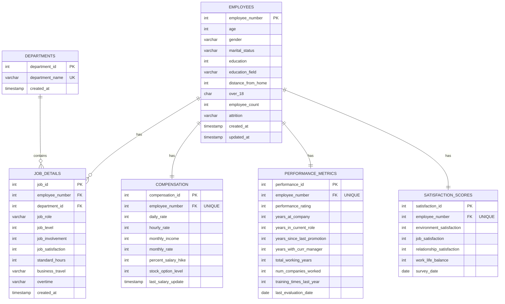

# HR Employee Attrition Prediction Pipeline

A comprehensive machine learning pipeline for predicting employee attrition using IBM HR Analytics dataset. This project implements a full-stack solution with dual database systems (MySQL and MongoDB), API endpoints, and ML prediction capabilities.

---

## 🎯 Project Overview

This project aims to build an end-to-end machine learning pipeline that:

- Stores HR employee data in both SQL (MySQL) and NoSQL (MongoDB) databases
- Provides RESTful APIs for data operations (CRUD)
- Implements ML models for attrition prediction

### Key Features

- **Dual Database Implementation**: MySQL (normalized) and MongoDB (document-based)
- **Data Validation**: Constraints, triggers, and validation schemas
- **Risk Assessment**: Stored procedures for calculating attrition risk
- **Python Import Scripts**: Automated data loading from CSV
- **Comprehensive Documentation**: Detailed design and implementation guides

---

## 📊 Dataset Information

- **Name**: IBM HR Analytics Employee Attrition & Performance
- **Source**: Kaggle
- **Records**: 1,470 employees
- **Features**: 35 attributes including:
  - Personal information (age, gender, education, marital status)
  - Job details (role, department, level, satisfaction)
  - Compensation (salary, stock options, benefits)
  - Performance metrics (years at company, promotions, training)
  - Target variable: Attrition (Yes/No)

---

## 📚 Tasks Overview

### Task 1: Database Design

Implementation of dual database systems (MySQL and MongoDB) with complete schema design, stored procedures, triggers, and automated data import scripts.

**📖 [View Task 1 Documentation](./task_1_database_in_sql_and_mongo/README.md)**

#### Database Schema (ERD)



**Key Tables:**

- **6 normalized tables** for MySQL implementation
- **3 collections** for MongoDB implementation
- **Stored procedures** for attrition risk calculation
- **Triggers** for automatic timestamp updates

### Task 2: API Development

RESTful API endpoints for CRUD operations on employee data with deployment.

### Task 3: ML Model Development

Machine learning models for predicting employee attrition.

---

### Installation

```bash
# Clone the repository
git clone https://github.com/izabayo7/database-prediction-pipeline.git
cd database-prediction-pipeline

# Set up Python environment
source .venv/bin/activate  # On macOS/Linux

```

---

## 🤝 Contributing

Each task has its own folder with dedicated documentation. When contributing:

1. Work in your assigned task folder
2. Create a README.md in your task folder with setup instructions
3. Follow the snake_case naming convention for folders
4. Update this main README with a link to your task's documentation

---

## 👥 Team

### Contributors

| Name               | GitHub                                               | Role                         |
| ------------------ | ---------------------------------------------------- | ---------------------------- |
| Cedric Izabayo     | [@izabayo7](https://github.com/izabayo7)             | Task 1: Database Design      |
| Peace Keza         | [@Peace3B](https://github.com/Peace3B)               | Task 1: Database Design      |
| Denyse Mutoni      | [@dmutoni](https://github.com/dmutoni)               | Task 2: API Development      |
| Patrick Niyogitare | [@thepatrickniyo](https://github.com/thepatrickniyo) | Task 3: ML Model Development |

---

## 📝 License

This project is part of an academic assignment at ALU (African Leadership University).

---

## 🔗 Resources

- [Kaggle Dataset](https://www.kaggle.com/datasets/pavansubhasht/ibm-hr-analytics-attrition-dataset)
- [MySQL Documentation](https://dev.mysql.com/doc/)
- [MongoDB Documentation](https://docs.mongodb.com/)
- [Pandas Documentation](https://pandas.pydata.org/docs/)

---

**Happy Coding! 🚀**
