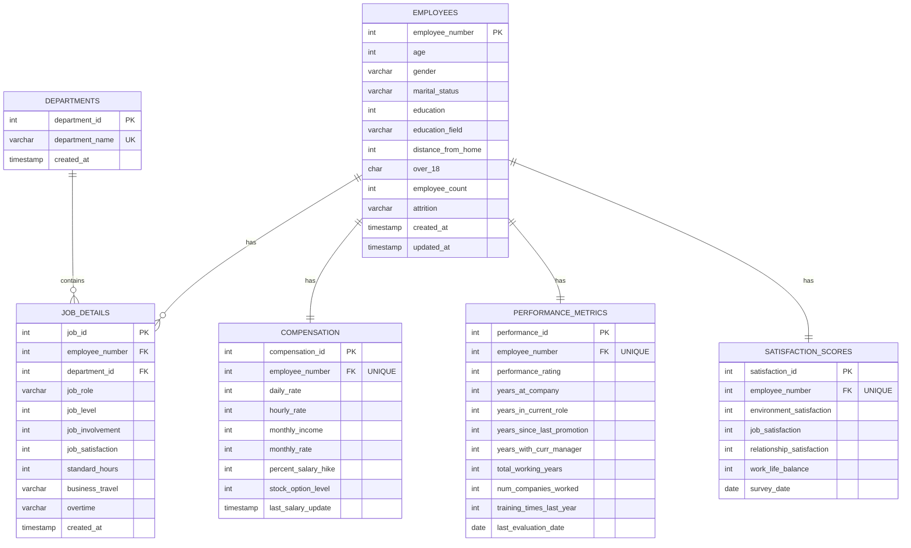

# Task 1: Database Design for HR Employee Attrition Dataset

## Dataset Information

- **Dataset Name**: IBM HR Analytics Employee Attrition & Performance
- **Source**: Kaggle
- **Purpose**: Predict employee attrition using machine learning
- **Total Columns**: 35 attributes per employee

---

## Part A: MySQL Database Design

### 1. Database Schema

```sql
-- Create Database
CREATE DATABASE IF NOT EXISTS hr_attrition_db;
USE hr_attrition_db;

-- Table 1: EMPLOYEES (Personal Information)
CREATE TABLE employees (
    employee_number INT PRIMARY KEY,
    age INT NOT NULL CHECK (age >= 18 AND age <= 100),
    gender VARCHAR(10) NOT NULL CHECK (gender IN ('Male', 'Female')),
    marital_status VARCHAR(20) NOT NULL CHECK (marital_status IN ('Single', 'Married', 'Divorced')),
    education INT NOT NULL CHECK (education BETWEEN 1 AND 5),
    education_field VARCHAR(50) NOT NULL,
    distance_from_home INT NOT NULL CHECK (distance_from_home >= 0),
    over_18 CHAR(1) NOT NULL CHECK (over_18 IN ('Y', 'N')),
    employee_count INT DEFAULT 1,
    attrition VARCHAR(3) NOT NULL CHECK (attrition IN ('Yes', 'No')),
    created_at TIMESTAMP DEFAULT CURRENT_TIMESTAMP,
    updated_at TIMESTAMP DEFAULT CURRENT_TIMESTAMP ON UPDATE CURRENT_TIMESTAMP
);

-- Table 2: DEPARTMENTS
CREATE TABLE departments (
    department_id INT AUTO_INCREMENT PRIMARY KEY,
    department_name VARCHAR(100) UNIQUE NOT NULL,
    created_at TIMESTAMP DEFAULT CURRENT_TIMESTAMP
);

-- Table 3: JOB_DETAILS (Current Job Information)
CREATE TABLE job_details (
    job_id INT AUTO_INCREMENT PRIMARY KEY,
    employee_number INT NOT NULL,
    department_id INT NOT NULL,
    job_role VARCHAR(100) NOT NULL,
    job_level INT NOT NULL CHECK (job_level BETWEEN 1 AND 5),
    job_involvement INT NOT NULL CHECK (job_involvement BETWEEN 1 AND 4),
    job_satisfaction INT NOT NULL CHECK (job_satisfaction BETWEEN 1 AND 4),
    standard_hours INT DEFAULT 80,
    business_travel VARCHAR(50) NOT NULL CHECK (business_travel IN ('Non-Travel', 'Travel_Rarely', 'Travel_Frequently')),
    overtime VARCHAR(3) NOT NULL CHECK (overtime IN ('Yes', 'No')),
    created_at TIMESTAMP DEFAULT CURRENT_TIMESTAMP,
    FOREIGN KEY (employee_number) REFERENCES employees(employee_number) ON DELETE CASCADE,
    FOREIGN KEY (department_id) REFERENCES departments(department_id)
);

-- Table 4: COMPENSATION (All Pay-Related Data)
CREATE TABLE compensation (
    compensation_id INT AUTO_INCREMENT PRIMARY KEY,
    employee_number INT NOT NULL UNIQUE,
    daily_rate INT NOT NULL CHECK (daily_rate > 0),
    hourly_rate INT NOT NULL CHECK (hourly_rate > 0),
    monthly_income INT NOT NULL CHECK (monthly_income > 0),
    monthly_rate INT NOT NULL CHECK (monthly_rate > 0),
    percent_salary_hike INT NOT NULL CHECK (percent_salary_hike BETWEEN 0 AND 100),
    stock_option_level INT NOT NULL CHECK (stock_option_level BETWEEN 0 AND 3),
    last_salary_update TIMESTAMP DEFAULT CURRENT_TIMESTAMP ON UPDATE CURRENT_TIMESTAMP,
    FOREIGN KEY (employee_number) REFERENCES employees(employee_number) ON DELETE CASCADE
);

-- Table 5: PERFORMANCE_METRICS (Experience & Performance)
CREATE TABLE performance_metrics (
    performance_id INT AUTO_INCREMENT PRIMARY KEY,
    employee_number INT NOT NULL UNIQUE,
    performance_rating INT NOT NULL CHECK (performance_rating BETWEEN 1 AND 4),
    years_at_company INT NOT NULL CHECK (years_at_company >= 0),
    years_in_current_role INT NOT NULL CHECK (years_in_current_role >= 0),
    years_since_last_promotion INT NOT NULL CHECK (years_since_last_promotion >= 0),
    years_with_curr_manager INT NOT NULL CHECK (years_with_curr_manager >= 0),
    total_working_years INT NOT NULL CHECK (total_working_years >= 0),
    num_companies_worked INT NOT NULL CHECK (num_companies_worked >= 0),
    training_times_last_year INT NOT NULL CHECK (training_times_last_year >= 0),
    last_evaluation_date DATE DEFAULT (CURRENT_DATE),
    FOREIGN KEY (employee_number) REFERENCES employees(employee_number) ON DELETE CASCADE
);

-- Table 6: SATISFACTION_SCORES (All Satisfaction Metrics)
CREATE TABLE satisfaction_scores (
    satisfaction_id INT AUTO_INCREMENT PRIMARY KEY,
    employee_number INT NOT NULL UNIQUE,
    environment_satisfaction INT NOT NULL CHECK (environment_satisfaction BETWEEN 1 AND 4),
    job_satisfaction INT NOT NULL CHECK (job_satisfaction BETWEEN 1 AND 4),
    relationship_satisfaction INT NOT NULL CHECK (relationship_satisfaction BETWEEN 1 AND 4),
    work_life_balance INT NOT NULL CHECK (work_life_balance BETWEEN 1 AND 4),
    survey_date DATE DEFAULT (CURRENT_DATE),
    FOREIGN KEY (employee_number) REFERENCES employees(employee_number) ON DELETE CASCADE
);

-- Create Indexes for Better Performance
CREATE INDEX idx_employee_attrition ON employees(attrition);
CREATE INDEX idx_job_department ON job_details(department_id);
CREATE INDEX idx_performance_rating ON performance_metrics(performance_rating);
CREATE INDEX idx_satisfaction_employee ON satisfaction_scores(employee_number);
```

### 2. Stored Procedure (MySQL Version)

```sql
-- Drop procedure if exists
DROP PROCEDURE IF EXISTS calculate_attrition_risk;

DELIMITER $$

-- Stored Procedure: Calculate Attrition Risk Score
CREATE PROCEDURE calculate_attrition_risk(IN emp_number INT)
BEGIN
    DECLARE risk_points INT DEFAULT 0;
    DECLARE risk_level VARCHAR(20);
    DECLARE risk_factors TEXT DEFAULT '';
    DECLARE job_sat INT;
    DECLARE env_sat INT;
    DECLARE work_balance INT;
    DECLARE years_no_promo INT;
    DECLARE is_overtime VARCHAR(3);
    DECLARE income_level INT;

    -- Get employee satisfaction scores
    SELECT
        job_satisfaction,
        environment_satisfaction,
        work_life_balance
    INTO job_sat, env_sat, work_balance
    FROM satisfaction_scores
    WHERE employee_number = emp_number;

    -- Get performance metrics
    SELECT years_since_last_promotion
    INTO years_no_promo
    FROM performance_metrics
    WHERE employee_number = emp_number;

    -- Get job details
    SELECT overtime
    INTO is_overtime
    FROM job_details
    WHERE employee_number = emp_number;

    -- Get compensation
    SELECT monthly_income
    INTO income_level
    FROM compensation
    WHERE employee_number = emp_number;

    -- Calculate risk based on multiple factors
    IF job_sat <= 2 THEN
        SET risk_points = risk_points + 25;
        SET risk_factors = CONCAT(risk_factors, 'Low Job Satisfaction, ');
    END IF;

    IF env_sat <= 2 THEN
        SET risk_points = risk_points + 20;
        SET risk_factors = CONCAT(risk_factors, 'Low Environment Satisfaction, ');
    END IF;

    IF work_balance <= 2 THEN
        SET risk_points = risk_points + 20;
        SET risk_factors = CONCAT(risk_factors, 'Poor Work-Life Balance, ');
    END IF;

    IF years_no_promo >= 5 THEN
        SET risk_points = risk_points + 15;
        SET risk_factors = CONCAT(risk_factors, 'Long Time Without Promotion, ');
    END IF;

    IF is_overtime = 'Yes' THEN
        SET risk_points = risk_points + 10;
        SET risk_factors = CONCAT(risk_factors, 'Frequent Overtime, ');
    END IF;

    IF income_level < 3000 THEN
        SET risk_points = risk_points + 10;
        SET risk_factors = CONCAT(risk_factors, 'Below Average Income, ');
    END IF;

    -- Determine risk level
    IF risk_points >= 60 THEN
        SET risk_level = 'HIGH';
    ELSEIF risk_points >= 30 THEN
        SET risk_level = 'MEDIUM';
    ELSE
        SET risk_level = 'LOW';
    END IF;

    -- Remove trailing comma and space
    IF LENGTH(risk_factors) > 2 THEN
        SET risk_factors = SUBSTRING(risk_factors, 1, LENGTH(risk_factors) - 2);
    END IF;

    -- Return results
    SELECT
        emp_number AS employee_id,
        risk_points AS risk_score,
        risk_level,
        risk_factors;
END$$

DELIMITER ;
```

### 3. Trigger (MySQL Version)

```sql
-- Drop trigger if exists
DROP TRIGGER IF EXISTS log_salary_changes;

DELIMITER $$

-- Trigger: Log Salary Changes
CREATE TRIGGER update_salary_timestamp
BEFORE UPDATE ON compensation
FOR EACH ROW
BEGIN
    -- Update the last_salary_update timestamp when salary changes
    IF NEW.monthly_income != OLD.monthly_income THEN
        SET NEW.last_salary_update = CURRENT_TIMESTAMP;
    END IF;
END$$

DELIMITER ;

-- Additional Trigger: Update employee timestamp
DROP TRIGGER IF EXISTS update_employee_timestamp;

DELIMITER $$

CREATE TRIGGER update_employee_timestamp
BEFORE UPDATE ON employees
FOR EACH ROW
BEGIN
    SET NEW.updated_at = CURRENT_TIMESTAMP;
END$$

DELIMITER ;
```

---

## Part B: MongoDB Database Design

### MongoDB Collections Structure

```javascript
// Database: hr_attrition_nosql

// Collection 1: employees
{
  "_id": ObjectId(),
  "employee_number": 1,
  "personal_info": {
    "age": 41,
    "gender": "Female",
    "marital_status": "Single",
    "education": {
      "level": 2,  // 1-5 scale
      "field": "Life Sciences"
    },
    "distance_from_home": 1,
    "over_18": "Y"
  },
  "job_info": {
    "department": "Sales",
    "role": "Sales Executive",
    "level": 2,
    "involvement": 3,  // 1-4 scale
    "standard_hours": 80,
    "business_travel": "Travel_Rarely",
    "overtime": "Yes"
  },
  "compensation": {
    "daily_rate": 1102,
    "hourly_rate": 94,
    "monthly_income": 5993,
    "monthly_rate": 19479,
    "percent_salary_hike": 11,
    "stock_option_level": 0
  },
  "performance": {
    "rating": 3,  // 1-4 scale
    "years_at_company": 6,
    "years_in_current_role": 4,
    "years_since_last_promotion": 0,
    "years_with_current_manager": 5,
    "total_working_years": 8,
    "num_companies_worked": 8,
    "training_times_last_year": 0
  },
  "satisfaction_scores": {
    "environment": 2,  // 1-4 scale
    "job": 4,  // 1-4 scale
    "relationship": 1,  // 1-4 scale
    "work_life_balance": 1  // 1-4 scale
  },
  "attrition_info": {
    "status": "Yes",
    "risk_score": null,  // To be calculated
    "last_risk_assessment": null
  },
  "metadata": {
    "created_at": ISODate("2024-01-15T10:00:00Z"),
    "updated_at": ISODate("2024-01-15T10:00:00Z"),
    "employee_count": 1
  }
}

// Collection 2: departments (Reference collection)
{
  "_id": ObjectId(),
  "department_name": "Sales",
  "employee_count": 145,
  "avg_attrition_rate": 0.23,
  "last_updated": ISODate("2024-01-15T10:00:00Z")
}

// Collection 3: attrition_predictions (For ML predictions)
{
  "_id": ObjectId(),
  "employee_number": 1,
  "prediction_date": ISODate("2024-01-15T10:00:00Z"),
  "predicted_attrition": "High Risk",
  "probability": 0.78,
  "model_version": "v1.0",
  "features_used": {
    "job_satisfaction": 2,
    "work_life_balance": 1,
    "years_since_promotion": 5,
    "overtime": true,
    "monthly_income": 5993
  }
}
```

### MongoDB Validation Schema

```javascript
// Validation rules for employees collection
db.createCollection("employees", {
  validator: {
    $jsonSchema: {
      bsonType: "object",
      required: [
        "employee_number",
        "personal_info",
        "job_info",
        "compensation",
        "performance",
        "satisfaction_scores",
        "attrition_info",
      ],
      properties: {
        employee_number: {
          bsonType: "int",
          description: "Must be a unique integer",
        },
        personal_info: {
          bsonType: "object",
          required: ["age", "gender", "marital_status"],
          properties: {
            age: {
              bsonType: "int",
              minimum: 18,
              maximum: 100,
            },
            gender: {
              enum: ["Male", "Female"],
            },
            marital_status: {
              enum: ["Single", "Married", "Divorced"],
            },
          },
        },
        "satisfaction_scores.environment": {
          bsonType: "int",
          minimum: 1,
          maximum: 4,
        },
        "satisfaction_scores.job": {
          bsonType: "int",
          minimum: 1,
          maximum: 4,
        },
        "attrition_info.status": {
          enum: ["Yes", "No"],
        },
      },
    },
  },
});

// Create indexes for better query performance
db.employees.createIndex({ employee_number: 1 }, { unique: true });
db.employees.createIndex({ "attrition_info.status": 1 });
db.employees.createIndex({ "job_info.department": 1 });
db.employees.createIndex({ "personal_info.age": 1 });
db.employees.createIndex({ "compensation.monthly_income": 1 });
```

---

## Part C: Entity Relationship Diagram (ERD)

### Database Schema Visualization



### Relationship Details

| Relationship                    | Type | Description                                    |
| ------------------------------- | ---- | ---------------------------------------------- |
| EMPLOYEES → JOB_DETAILS         | 1:M  | One employee can have multiple job assignments |
| DEPARTMENTS → JOB_DETAILS       | 1:M  | One department contains many employees         |
| EMPLOYEES → COMPENSATION        | 1:1  | Each employee has one compensation record      |
| EMPLOYEES → PERFORMANCE_METRICS | 1:1  | Each employee has one performance record       |
| EMPLOYEES → SATISFACTION_SCORES | 1:1  | Each employee has one satisfaction record      |

### Key Constraints

- **Primary Keys (PK)**: Uniquely identify each record
- **Foreign Keys (FK)**: Maintain referential integrity
- **Unique Keys (UK)**: Ensure no duplicate values
- **CASCADE DELETE**: Removing an employee removes all related records

---

## Summary

This database design successfully:

- ✅ Contains 6 main tables (exceeds 3 table requirement)
- ✅ Properly defines all primary and foreign keys
- ✅ Includes constraints for data validation
- ✅ Implements stored procedure for risk calculation (MySQL compatible)
- ✅ Implements triggers for timestamp updates (MySQL compatible)
- ✅ Provides MongoDB equivalent with embedded and referenced documents
- ✅ Maintains all 35 columns from the original dataset
- ✅ Follows 3NF normalization principles
- ✅ Ready for machine learning predictions
